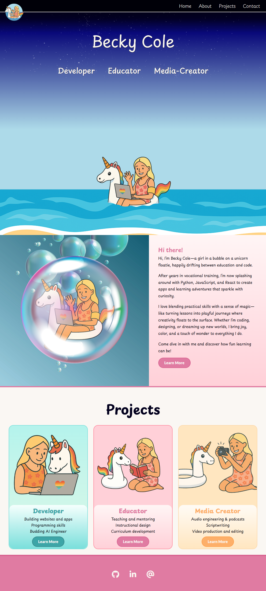
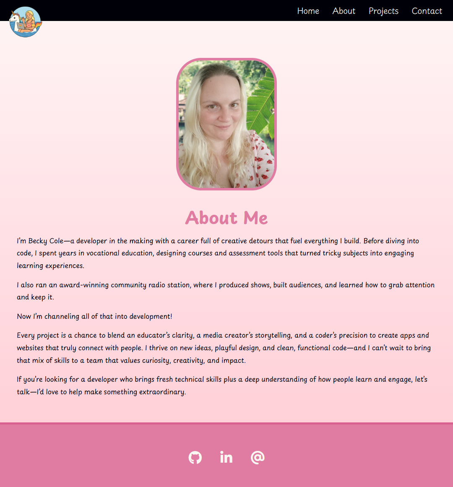

# Rebecca-de-Winter - Portfolio Task

​
[My portfolio site](https://rebecca-de-winter.github.io/)
​

## Project Requirements

### Content

Add a short paragraph describing the features below. What aesthetic and technical choices did you make?

- [x] At least one profile picture
- [x] Biography (at least 100 words)
- [x] Functional Contact Form
- [x] "Projects" section
- [x] Links to external sites, e.g. GitHub and LinkedIn.
      ​

### Content Response:

In terms of the overall feel of the website, I wanted an active and playful feel that shows off my creative side. For this reason I wanted to have my animated character play in the water because yes I have a unicorn floatie, yes I love bubbles and damn right I'm playful at heart! I chose lots of pastels, playful fonts and soft gradients for the colour palette.  

I have multiple profiles pictures, including an animated version of me in the header, hero, about me sections and the project section. I included a real picture on the about me section.  

I have a mini bio on the index.html page and a longer bio on the about me page. I included a girl in bubble animation for the about me section as I wanted to keep the theme light.

The "about me" is in shades of gradient pink which I feel is cute and matches the feel I was looking for.
Contact form - I have a contact form on site and "mailto" link attached to the @ sign in the footer.

Projects section: split into 3 sections - develop, educator and media creator - all colour coded with live links to real projects. Getting the Articulate course to nest inside was a major win!

I wanted to showcase how I can bring a lot of skills to a developer role by showcasing that I can teach and create media as well. I also made a projects page with three example types for each that showcase the depth of my experience. I chose cards because they define different projects easily and are very responsive.
I figure if each of my skill sets have a different colour, it will be easy to upload and categorise my projects which should make it easier for the user to find the examples that are relevant to them. I have links to GitHub, LinkedIn, and an email link in the footer 

### Technical

Add a short paragraph describing the features below. What strategies or design decisions did you work from?

- [x] At least 2 web pages.
- [x] Version controlled with Git
- [x] Deployed on GitHub pages.
- [x] Implements responsive design principles.
- [x] Uses semantic HTML.

### Technical Response:

Ok so this was a journey.

Initially tried to do a parallax scroll animation for the hero but it got too difficult to make it responsive. I then started from scratch and used the SheCodes template as a base for the second iteration. BIG MISTAKE!!!
I have spent more time trying to solve bugs that the older code included in the code then I could have keeping the first site and building that up to be responsive.

I simplified the idea and made a drop down animation where the girl in the bubble bobs in the water. This was done entirely using CSS animation, using a drop down animation for the logo drop, an opacity transition once she hits the water and a bob animation that lasts indefinately. The title was also animated, with a slide in left, right and top for "developer, educator and media creator". Getting the calculation right for the positioning of the girl hitting the water was a major mission but now fixed!! I added a delay in the title as I realised in layouts with a narrower height made the logo clash with the titles. They are now spaced out. I have been using the inspect tool to view the project from every perspective for both Chrome and Firefox. There is also an animation for the girl in the bubble in the about me section on index.html.

Making the cards responsive on the projects page was far easier because I could use Flexbox and wrap the cards. The other pages (about me and contact) had no problems with responsiveness. Next time around I want to have a document viewer for the learner guide and slide deck uploads but am unsure of how they would fit with the design.  

It was version controlled with Git and deployed on GitHub pages. I've spend the most amount of time trying to ensure everything was responsive. Semantic HTML was used throughout.

### Bonus (optional)

Add a short paragraph describing the features below, if you included any.

- [x] Different styles for active, hover and focus states.
- [x] Include JavaScript to add some dynamic elements to your site. (Extra tricky!)
      ​

### Bonus response:

I have styles for active, hover and focus states - the primary buttons translate 1 px up and left on hover, and have a glow shadow. On focus, they scale (1.04) and deepen in colour when active with a box shadow.
The social media icons transform by scale on hover, scale higher again on active and glow with a text shadow on focus. Javascript was included to make the hamburger menu. It also expands out and has a scale hover on the drop down hamburger menu.
Submit menu has inner shadow on hover and a brighter colour on active.

### Screenshots

> Please include the following:
>
> - The different pages and features of your website on mobile, tablet and desktop screen sizes (multiple screenshots per page and screen size).
> - The different features of your site, e.g. if you have hover states, take a screenshot that shows that.
>
> You can do this by saving the images in a folder in your repo, and including them in your readme document with the following Markdown code:

#### image_title_goes_here

Here are a list of screenshots:

## Animation

### Animated hero drop:

### Animated about me bob:

### Animated JavaScript hambuger menu with hover/active/focus

### Animated primary button - hover/active/focus (used throughout site)

### Animated social media icons - hover/focus/active

### Animated submit button - hover/active/focus

## Screenshots

### Full header

### Hamburger menu

### Index.html desktop size full page

### Index.html responsive layout

### About.html desktop size full page

### About.html responsive layout

### Projects.html desktop size full page

### Projects.html responsive layout

### Contact page desktop full size

### Contact page responsive layout

